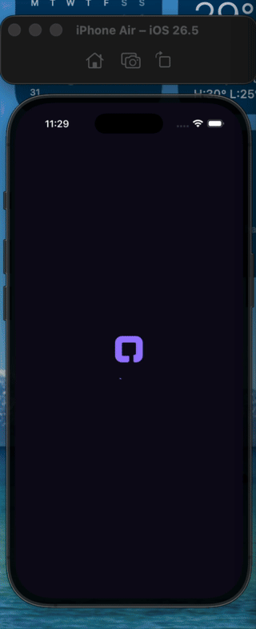

# Qredet

A Flutter wallet app I put together for a technical assessment. Wallet dashboard, language switching, a transactions list, notifications, and a payment flow with PIN confirmation — the kind of screens you'd expect from a fintech app, minus any money actually moving anywhere.

## Demo



Full-length screen recording: [docs/demo/qredet-demo-video.mov](docs/demo/qredet-demo-video.mov) — also on [Google Drive](https://drive.google.com/file/d/1y3mEo9xIJguuNa6TLbfW9X8932DhXbLS/view)

## How I approached it

I went feature-first rather than layer-first, so `lib/features/<name>` each has its own `domain / data / presentation` split. It's more files up front, but it means a feature can be deleted, rewritten, or handed to someone else without them needing to understand the rest of the app first.

Every feature talks to the outside world through a single repository interface, and behind that interface sits either a mock data source or a real one (HTTP for home data, Firebase for auth), switched with one flag in `AppConfig`. That let me build and demo the whole thing without standing up a backend — flip `useMockHomeData` / `useMockAuth` to `false` once there's something real to point at.

State management is `flutter_bloc` everywhere (no cubits), with `freezed` unions for events and state. Blocs only ever call usecases, never repositories directly, so a bloc never has to know or care how data is actually fetched.

## What's in it

- **Language** — picker in a frosted glass bottom sheet, persisted with Hive
- **Home** — wallet dashboard, virtual account chip, upgrade tiers
- **Transactions** — searchable, paginated "see all" list
- **Auth** — login / sign-up / guest, gated by `go_router` redirects off a splash screen
- **Payment** — make a payment → PIN entry → animated success screen
- **Notifications** — paginated, swipe to delete or mark as read

Fully localized across 20 languages.

## Running it

```
flutter pub get
dart run build_runner build --delete-conflicting-outputs
flutter run
```

Everything defaults to mock data, so it runs standalone with no backend setup.

## Tests

The notifications feature has a full `mockito`-based suite (bloc, usecases, repository). I didn't get to writing equivalent coverage for every other feature — see below.

## Git history

Built and merged as one PR per feature/chore against `main`, in the order dependencies actually needed (core scaffold, then language, home, transactions, auth, and so on). A few of the commits do more than one thing at once — the payment and notifications screens went in together, for instance — so the branch names are a best fit rather than a perfect 1:1 split.

## If I had more time

- Tests for the rest of the features, not just notifications
- Real Firebase config instead of the mock/HTTP placeholder switch
- Would go back and split a couple of the bigger commits more cleanly by feature

— devfunmilayor
